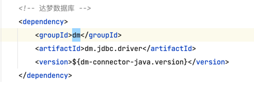
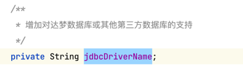
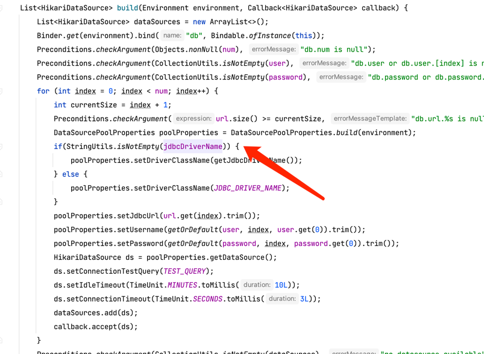
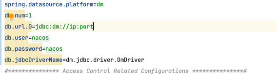

# nacos-dm

修改了nacos支持达梦数据库
需要重新编译nacos使用

1  nacos项目主pom文件增加达梦jdbc驱动包

2 nacos-config 模块下的ExternalDataSourceProperties.java类新增jdbcDriverName字段

3 修改console模块下的application.properties

构建项目
进入源代码目录执行
mvn -Prelease-nacos -Dmaven.test.skip=true -Dpmd.skip=true -Dcheckstyle.skip=true clean install -U

构建后在nacos工程目录distribution/target/nacos-server-2.1.0-SNAPSHOT/nacos 目录里面就是编译好的nacos目录

启动nacos
sh startup.sh -m standalone
